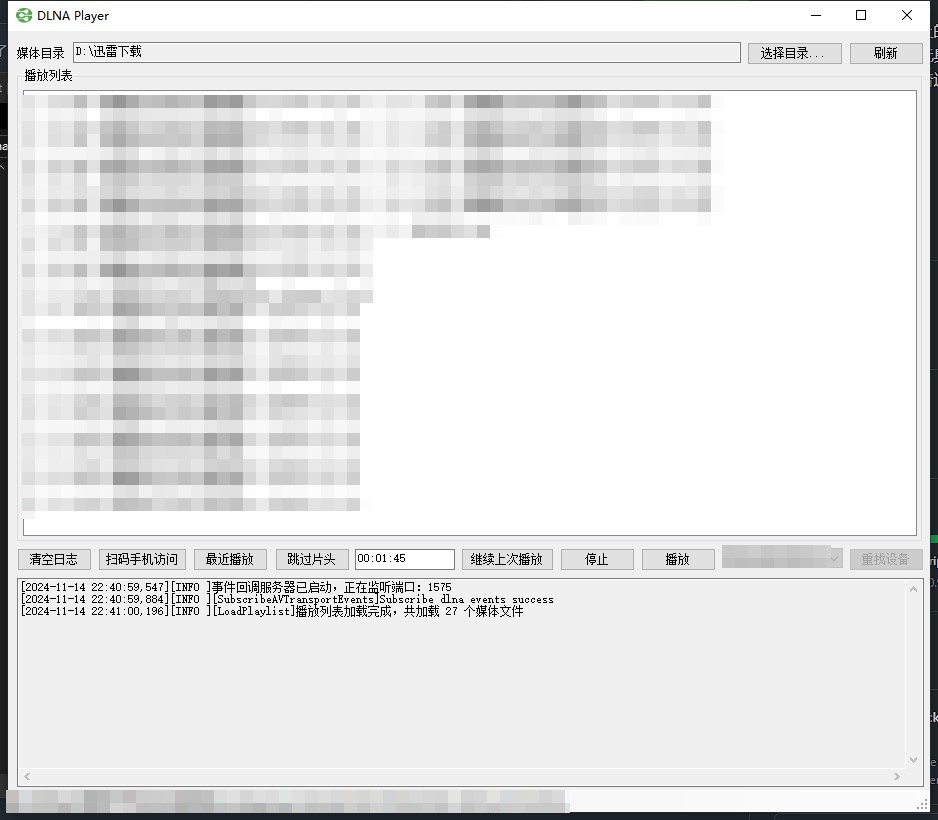

# 🎬 DLNA Player 🎬

`DLNA Player` 是我为了把电脑上的视频投射到电视上观看，特别定制的一个小工具。📺 它目前只适用于我的长虹电视，所以可能并不适用于所有 DLNA 设备。如果你想要将它用在其他 DLNA 设备上，可能需要进行一些个性化的适配哦。🛠️

## 🌟 主要功能 🌟

- 🔍 **自动发现**：支持自动发现局域网内的 DLNA 设备。
- 📂 **任意选择**：支持选择本地任意文件夹中的视频，投射到 DLNA 设备播放。
- 🔁 **连续播放**：支持自动连续播放，让你的观看体验更加流畅。

## 💻 编译 & 运行环境 💻

- 需要 **.Net Framework 4.8** 环境。

## 🛠️ 使用方法 🛠️

1. 打开你的终端或命令提示符，输入以下命令来克隆项目：`git clone https://github.com/kuzzh/DlnaPlayer.git`
2. 使用 **Visual Studio 2022** 打开项目文件 `DlnaPlayer.sln`。
3. 按下 **F6** 开始编译，耐心等待编译完成。
4. 将 **nginx** 文件夹整个复制到 **./DlnaPlayerApp/bin/Debug** 下。
5. 最后，按下 **F5** 运行程序，享受你的 DLNA 播放体验吧！

## 📸 运行截图 📸

 
